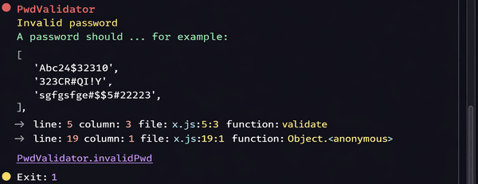
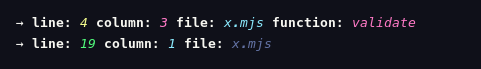
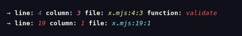

# SweetError

Makes nodeJs Error cleaner, more readable and better formatted

- [SweetError](#sweeterror)
  - [Installation](#installation)
  - [Example usage](#example-usage)
  - [Api reference](#api-reference)
    - [Configuration Properties](#configuration-properties)
    - [Instance properties](#instance-properties)
  - [License](#license)
  - [Changelog](#changelog)

## Installation

#### NodeJs

```sh
npm install sweet-error
```

## Example usage

```js
// cjs
const SweetError = require('sweet-error');
// mjs
import SweetError from 'sweet-error';

new SweetError(
  [
    'Invalid password',
    'A password should ... for example:',
    ['Abc242$3231@', '323CR#@#IY', 'sgfgsfg%$$5#22323'],
  ],
  {
    name: 'PwdValidator',
    code: 'PwdValidator.invalidPwd',
    exitCode: 1,
  }
);
```

<br />

<div align='center'>
  </img>
</div>

## Api reference

### `new SweetError(messages, [config])`

Creates a new `SweetError` instance.

**Parameters**:

- `messages` — An array of messages, where each message can be of any data type, and each index in the array represents a line.

  - **Required**
  - **Type:** `any[]`

- `config` — Optional configuration object, see [configuration properties](#configuration-properties)

  - **Optional**
  - **Type:** `Object`

## Configuration Properties

### `name`

Sets the name of the current error instance.

This is typically used to identify the type of error when logging or displaying it in the console.

- **Optional**
- **Type:** `string`
- **Default:** `undefined`

### `code`

Sets the current instance error code.

This can be used to programmatically identify or handle specific error types.

- **Optional**
- **Type:** `string`
- **Default:** `undefined`

**Example** :

```js
new SweetError(['ACCESERR Error!'], {
  code: 'ACCESERR',
});
```

### `exitCode`

Sets the code or signal name used to terminate the Node.js process when the instance triggers an exit.

- **Optional**
- **Type:** `number | string`
- **Default:** `undefined`

### `autoExit`

Controls whether the Node.js process should automatically exit after the error is logged.

Set this to `true` to terminate the process immediately after logging, or `false` to continue running and handle termination manually.

- **Optional**
- **Type:** `boolean`
- **Default:** `true`

**Example** :

```js
new SweetError({
  autoExit: false,
});

console.log('The process will NOT exit automatically');
```

### `colorize`

Enables or disables text colorization in the console output.

When set to `true`, the error messages will include colors for better readability.  
When `false`, all output will be plain text.

- **Optional**
- **Type:** `boolean`
- **Default:** `true`

### `locationStyle`

Determines how the error location (file, line, column) is formatted when displayed in the console.

This allows customization of the visual style of the location information for improved readability.

- **Optional**
- **Type:** `LocationStyle`
- **Default:** `'label'`

**Example** :

- `locationStyle: label` — For readable, human-friendly format.



- `locationStyle: coords` — Clickable links for IDEs / Standard IDE format.


- `locationStyle: full` — For most formal and complete format.



### `logger`

A custom function to control how the `SweetError` output is rendered.  
This function is provided via the configuration object when creating a new instance.

You can override this function to implement custom logging behavior, such as formatting output differently, or integrating with other logging systems.

- **Optional**
- **Type:** `(this: SweetError) => void`

**Example:**

```js
new SweetError(['Custom output!'], {
  logger() {
    console.log(this.func.colorize('Custom error message'));
  },
});
```

## Instance properties

### `.messages`

An array of messages used to initialize the error instance.

- **Type:** `any[]`

### `.name`

The name of the error instance.

- **Type:** `string`
- **Default:** `undefined`

### `.code`

The error code associated with this instance.

- **Type:** `string`
- **Default:** `undefined`

### `.exitCode`

The code or signal name used to terminate the Node.js process.

- **Type:** `number | string`
- **Default:** `undefined`

### `.autoExit`

Indicates whether the `SweetError` instance is configured to automatically exit the Node.js process after logging.

- **Type:** `boolean`
- **Default:** `true`

### `.locationStyle`

Indicates how the error location (file, line, column) is formatted for this `SweetError` instance when rendered in the console.

- **Type:** `LocationStyle`
- **Default:** `'label'`

### `.colorize`

Indicates whether the `SweetError` instance will render messages with color in the console.

- **Type:** `boolean`
- **Default:** `true`

### `.stack`

The stack trace captured by the `SweetError` instance at the time of creation.

- **Type:** `StackData[]`
- **Readonly**

### `.func`

A read-only collection of string formatting and transformation utilities available on the `SweetError` instance.

These utilities are primarily intended for use **inside a custom `logger` function** to help customize the format and appearance of the error output.

- **Readonly**

#### Utilities

- `colorize(sentence: string): string`  
  Applies random terminal colors to each word in a sentence using ANSI codes.

- `format(object: any): string`  
  Serializes an object into a JSON5-formatted string for pretty printing.

- `indent(string: string, padding: number): string`  
  Prepends a specific number of spaces to every line in a multiline string.

- `wrap(text: string, width: number): string`  
  Breaks a long string into multiple lines based on the specified character width.

**Example** :

```js
new SweetError(['Error Occurred!'], {
  logger() {
    const { wrap } = this.func;

    console.log(wrap('This is a long message that will be wrapped', 40));
  },
});
```

## License

This project is licensed under the MIT License — see the [LICENSE](./LICENSE) file for details.

## Changelog

See the [CHANGELOG](./CHANGELOG.md) for a detailed history of all changes, versions, and releases.
